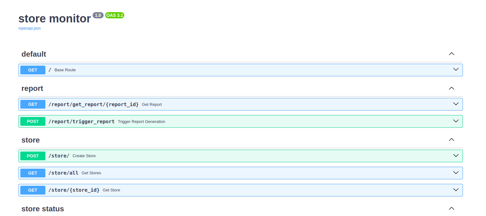
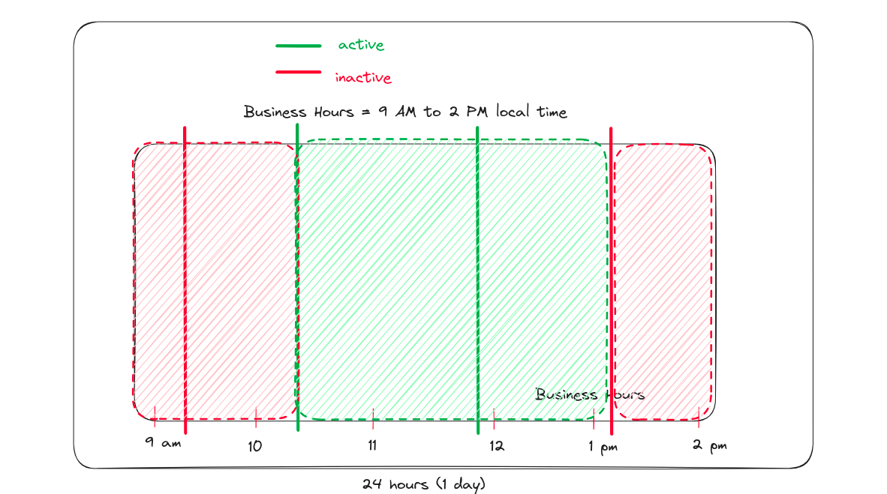

# Loop Store Monitoring Task

Note: the words `store` and `restaurant` are used interchangeably in this README.

## Local Setup Instructions

After cloning the project, `cd` into it, ensure that the following `csv` files are present in
the project root.

- menu-hours.csv
- store-status.csv
- timezones.csv
- .env (copy the example.env into it)

Then run the following commands in the project root.

### Build

This will build the dev environment and start the API server on `localhost:8000`
and the Postgres database server on `localhost:5432` using docker compose.

```shell
make build && make run
```

If the api server errors out because it cannot connect to the database server,
press `Ctrl-C` (`Cmd-C` on Mac) to stop the system.

Then, use `make run` to re-start the system and we're good to go.

The next step is to seed the database, but before that, it's a good idea to
validate that the API server is working as expected.

For verifying that, let's take a look at the routes that we have at our disposal.
open `localhost:8000/docs` on any browser.



The endpoints that we are interested in are the `report` endpoints, namely

- GET `/report/get_report/{report_id}`
- POST `/report/trigger_report`

The first one is to check the status of a running report using its `report_id`.
The second one is used to start the report generation. It will return immediately with the `report_id`.

Make a post request to the trigger report endpoint, it should return a random `report_id` like the
example given below

```json
{
  "report_id": "cced7481-898b-41ed-ba5d-437db5afe8f7"
}
```

Now, use the returned report id to make a GET request to the
get_report endpoint, which should return

```json
{
  "status": "RUNNING"
}
```

### Seed Database

In a new terminal, go to the project directory and run the following commands.

Note: In the scripts folder, the `seed_db.py` calls utility methods to
populate the db but to save time, it has a hard-coded limit of 100k records
for the `store-status.csv` which means it will only process 100k store status
poll events and then move onto the next data source. You can change this by passing a different
value in the script's `main` block method.

```shell
# create a python3 virtual env
python3 -m venv .venv
# activate it
source .venv/bin/activate
# start the seed script
python scripts/seed_db.py
```

This should seed the database with the sample data that we provide.
After the seed process is complete, we can try out the report routes,
which will store the reports to disk as CSV files and also return
the CSV data in json format.

## Uptime and Downtime calculation logic

A moving window algorithm was applied to efficiently average out uptimes and downtimes for each store.



The uptime/downtime calculation makes the following assumptions about
the data:

- If there are no polls from a restaurant during business hours, that implies the restaurant is down.
- If the polls fall outside business hours, then they are ignored.
- Since the stores are polled about once an hour, the presence of a single poll that has an active status during
  business hours, implies that the store will remain open during the remaining business hours unless a new poll is taken
  which has an inactive status.

#### The Algorithm

1. Loop over all stores and for each store, do the following:
2. Get the max value of timestamp_utc from the store status table.
3. Filter the table to fetch the events, one hour ago from the timestamp.
4. Fetch business hours for the current store and find the day of the week for max_timestamp.
5. For comparison between utc timestamps and business hours given in local time, we can convert the utc timestamp into
   local time.
6. Now, with the business hours for the max_timestamp:
    - go back one hour from max_timestamp
    - go through the events list until either the list is finished or max_timestamp is reached.
    - if the store is active during that time then
    - add the time difference between the event and starting time as uptime
    - else assume downtime
    - add the remaining time as downtime
7. Now, for calculating uptime/downtime for the last week and last day
8. Follow the same logic used for calculating uptime/downtime for last hour, but go back 7 days, excluding the
   max_timestamp day.
9. Store the uptimes and downtimes for each day, starting from one day before max_timestamp.